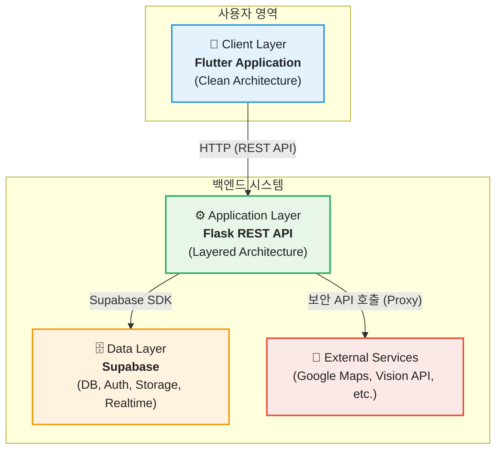
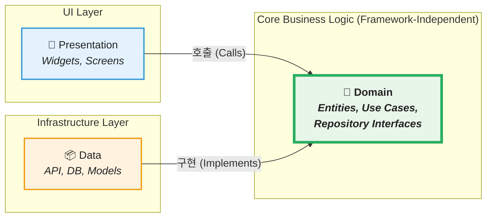
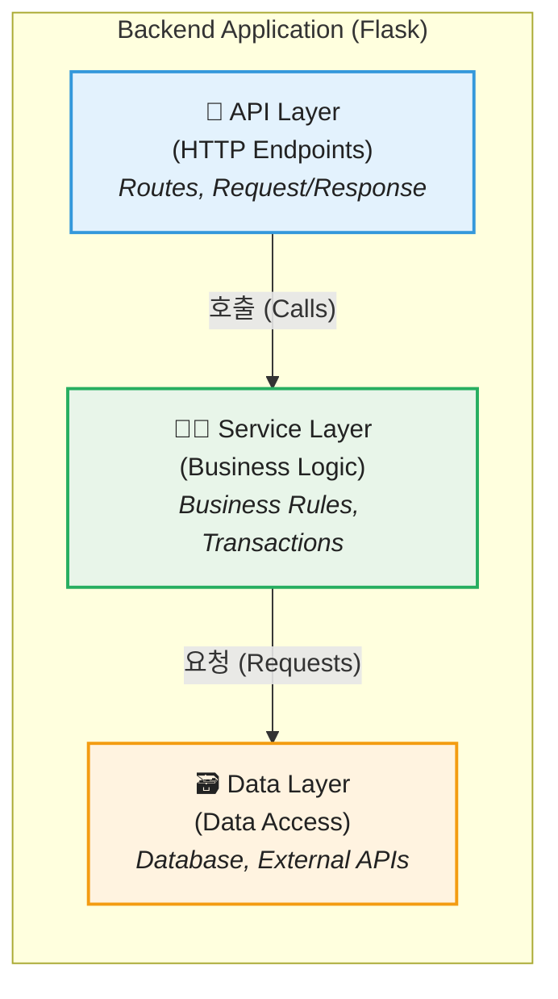
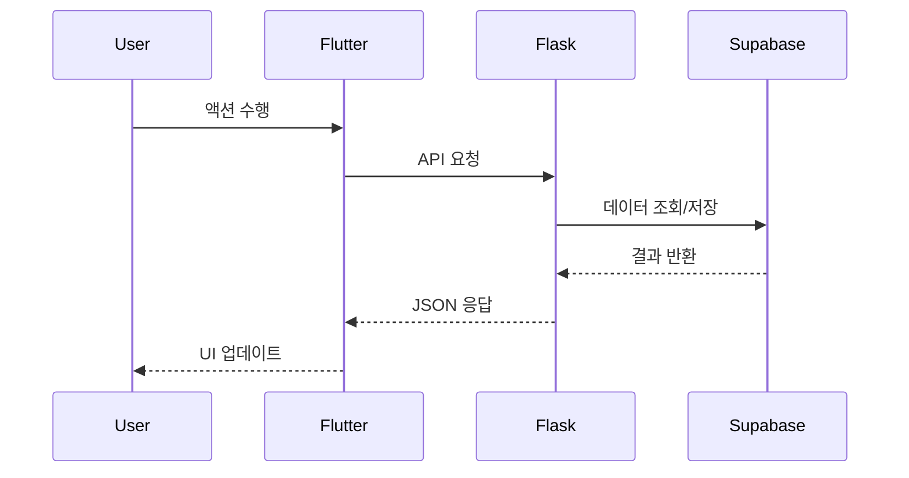
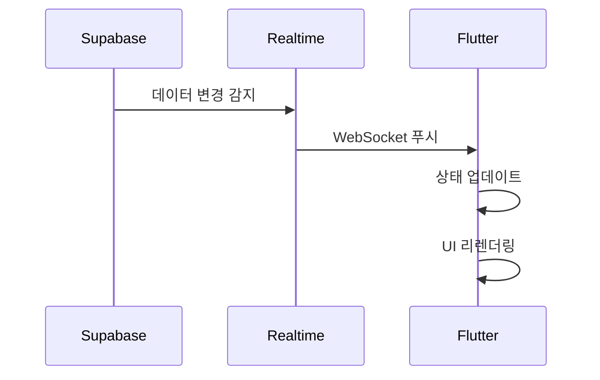
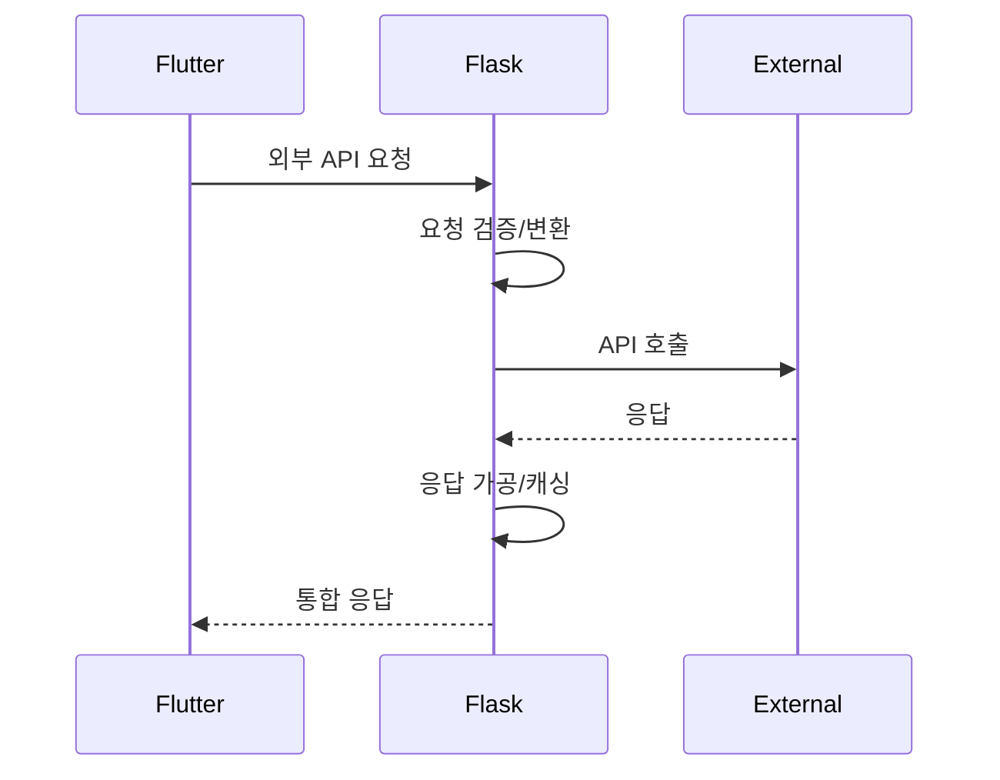

물론입니다! 훌륭하게 정리된 아키텍처 문서에 적절한 이모지를 추가하여 가독성과 시각적 재미를 더해 보겠습니다.

---

# 🏗️ 0.0 기술 아키텍처 개요

## 📋 목차
1. [개요](#1-개요)
2. [시스템 아키텍처](#2-시스템-아키텍처)
3. [Frontend 클린 아키텍처](#3-frontend-클린-아키텍처)
4. [Backend 계층형 아키텍처](#4-backend-계층형-아키텍처)
5. [기술 스택](#5-기술-스택)
6. [데이터 흐름](#6-데이터-흐름)

## 📜 1. 개요

Fallingo는 위치 기반 미식 SNS 서비스로, 사용자가 음식점 방문을 인증하고 경험을 공유하는 플랫폼입니다.

### ℹ️ 1.1 프로젝트 정보
| 항목 | 내용 |
|------|------|
| **서비스명** | 📛 Fallingo (폴링고) |
| **플랫폼** | 📱 iOS, Android |
| **아키텍처** | 🏛️ Frontend: 클린 아키텍처 / Backend: 계층형 아키텍처 |
| **개발 방식** | 🚀 로컬 MVP → 클라우드 확장 |

### 🎯 1.2 핵심 설계 원칙
- ✅ **🧩 관심사 분리**: 각 계층은 명확한 책임과 경계를 가짐
- ✅ **🔄 의존성 역전**: 비즈니스 로직은 외부 프레임워크에 의존하지 않음
- ✅ **🧪 테스트 가능성**: 각 계층을 독립적으로 테스트 가능
- ✅ **📈 확장성**: 새로운 기능 추가 시 기존 코드 수정 최소화

## 🌐 2. 시스템 아키텍처

### 🗺️ 2.1 전체 시스템 구조



### 💼 2.2 각 계층의 책임

| 계층 | 책임 | 핵심 기술 |
|------|------|-----------|
| 📱 **Client** | UI 렌더링, 사용자 상호작용, 상태 관리 | Flutter + Riverpod |
| ⚙️ **Application** | 비즈니스 로직, API 라우팅, 데이터 검증 | Flask + Python |
| 🗄️ **Data** | 데이터 영속성, 인증, 파일 저장, 실시간 동기화 | Supabase |
| 📡 **External** | 지도, AI 인식, 날씨 등 외부 서비스 | Google APIs |

## 🧼 3. Frontend 클린 아키텍처

### 💡 3.1 개념적 구조



### 🔗 3.2 의존성 규칙

```
presentation → domain ← data
```

- **🎨 Presentation Layer**: UI와 사용자 상호작용 처리
- **🧠 Domain Layer**: 순수 비즈니스 로직 (프레임워크 독립적)
- **📡 Data Layer**: 외부 시스템과의 통신 담당

### 💎 3.3 각 계층의 핵심 요소

#### 👑 Domain Layer (중심)
- **Entities**: 비즈니스 객체 (User, Feed, Restaurant 등)
- **Use Cases**: 비즈니스 규칙 실행 (SignIn, CreateFeed 등)
- **Repository Interfaces**: 데이터 접근 추상화

#### 📦 Data Layer (외부 연동)
- **Models**: DTO, JSON 매핑 객체
- **Data Sources**: API 클라이언트, 로컬 저장소
- **Repository Implementations**: 실제 데이터 접근 구현

#### 🖼️ Presentation Layer (UI)
- **Screens**: 전체 화면 위젯
- **Widgets**: 재사용 가능한 UI 컴포넌트
- **Providers**: Riverpod 상태 관리

## ⚙️ 4. Backend 계층형 아키텍처

### 🧱 4.1 개념적 구조



### 🛡️ 4.2 각 계층의 책임

#### 🔌 API Layer
- HTTP 요청/응답 처리
- 입력 검증
- 인증/인가 확인
- 에러 응답 포맷팅

#### 🧑‍🍳 Service Layer
- 비즈니스 로직 실행
- 트랜잭션 관리
- 여러 데이터 소스 조율
- 비즈니스 규칙 적용

#### 🗃️ Data Layer
- 데이터베이스 연동
- 외부 API 호출
- 데이터 모델 정의
- 캐싱 처리

## 📚 5. 기술 스택

### 📱 5.1 Frontend
| 카테고리 | 기술 | 버전 | 선택 이유 |
|----------|------|------|-----------|
| **Framework** | Flutter | 3.0+ | 단일 코드베이스로 iOS/Android 개발 |
| **상태 관리** | Riverpod | 2.4+ | 타입 안전성, 테스트 용이성 |
| **네트워킹** | Dio | 5.3+ | 인터셉터, 에러 처리 기능 |
| **라우팅** | GoRouter | 10.0+ | 선언적 라우팅, 딥링크 지원 |

### ☁️ 5.2 Backend
| 카테고리 | 기술 | 버전 | 선택 이유 |
|----------|------|------|-----------|
| **Framework** | Flask | 3.0+ | 경량, 빠른 개발, 유연성 |
| **Language** | Python | 3.13+ | 최신 기능, 성능 개선 |
| **ORM/SDK** | Supabase | 2.0+ | PostgreSQL + 추가 서비스 통합 |
| **서버** | Gunicorn | 21.2+ | 운영 환경 WSGI 서버 |

### 🔌 5.3 Infrastructure & Services
| 서비스 | 제공 기능 | 선택 이유 |
|--------|-----------|-----------|
| **Supabase** | DB, Auth, Storage, Realtime | 올인원 BaaS, 오픈소스 |
| **Google Maps** | 지도, 장소 검색 | 정확도, 한국 지원 |
| **Google Vision** | OCR, 이미지 인식 | 한국어 OCR 정확도 |
| **Open-Meteo** | 날씨 정보 | 무료, API 제한 없음 |

## 🌊 6. 데이터 흐름

### ➡️ 6.1 일반 요청 처리



### ⚡ 6.2 실시간 업데이트



### 🛡️ 6.3 외부 API 프록시



## ✅ 체크리스트

### 🧠 아키텍처 이해
- [ ] 3-Tier 시스템 아키텍처를 이해했는가?
- [ ] Frontend 클린 아키텍처의 의존성 규칙을 이해했는가?
- [ ] Backend 계층형 아키텍처의 책임 분리를 이해했는가?

### 👍 기술 선택
- [ ] 각 기술 스택의 선택 이유를 이해했는가?
- [ ] 외부 서비스의 역할과 필요성을 파악했는가?

### 🌊 데이터 흐름
- [ ] 일반 요청과 실시간 업데이트의 차이를 이해했는가?
- [ ] Flask가 외부 API 프록시 역할을 하는 이유를 이해했는가?

## 📝 다음 단계

아키텍처를 이해했으니 이제 개발 환경을 구축합니다.

- ➡️ [0.1_로컬_개발환경_구축.md](./0.1_로컬_개발환경_구축.md)