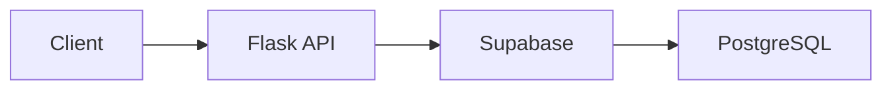
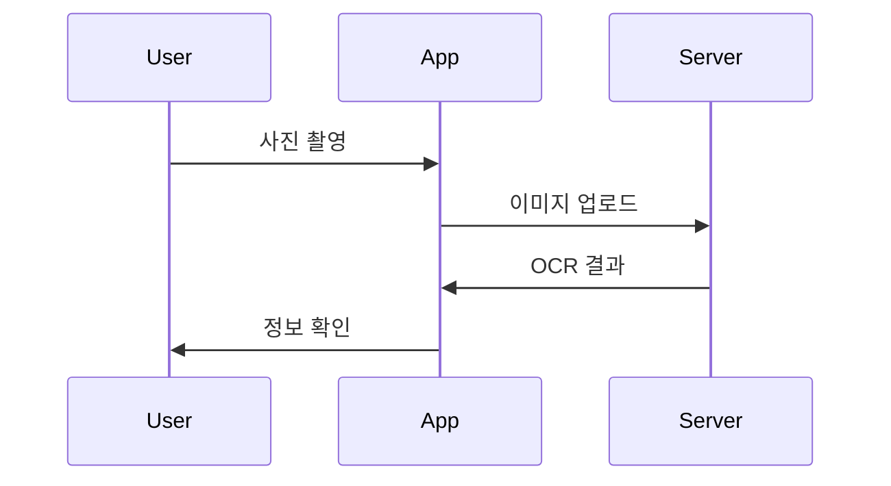

# 📝 Fallingo 문서 작성 가이드

본 문서는 Fallingo 서비스 개발 관련 문서를 AI가 일관되고 효율적으로 작성하기 위한 가이드라인입니다.

## ⚠️ 최우선 준수 사항

### 🔑 데이터 모델 일관성 필수 규칙

1. **단일 진실 공급원 (Single Source of Truth)**
   - 모든 데이터 모델은 `1.1_공통_데이터_모델.md`에서 정의
   - 다른 문서는 반드시 이 정의를 참조하고 따름
   
2. **필드명 일관성**
   ```dart
   // ✅ 한번 정의된 필드명 유지
   class User {
     final String userId;    // 모든 문서에서 userId 사용
     final String userName;  // 모든 문서에서 userName 사용
   }
   
   // ❌ 문서마다 다른 필드명 사용 금지
   // 문서A: userId, 문서B: id, 문서C: user_id
   ```

3. **모델 변경 시 체크리스트**
   - [ ] `1.1_공통_데이터_모델.md` 수정
   - [ ] Backend `models/` 파일 확인
   - [ ] Frontend `entities/` 파일 확인
   - [ ] API 문서 request/response 확인
   - [ ] 영향받는 모든 문서 동시 업데이트

### 📁 파일 경로 작성 필수 규칙

1. **절대 경로 사용 (프로젝트 루트 기준)**
   ```dart
   // ✅ 올바른 예
   // 파일: frontend/lib/features/auth/domain/entities/user.dart
   // 파일: backend/models/user.py
   
   // ❌ 잘못된 예
   // 파일: lib/features/auth/domain/entities/user.dart  // frontend 누락
   // 파일: models/user.py                               // backend 누락
   ```

2. **복사-붙여넣기 검증**
   - 작성한 경로를 그대로 사용해서 파일 생성 가능해야 함
   - 디렉토리 구조와 100% 일치 확인

## I. 🌟 일반 가이드라인

### 1. 기본 원칙

1. **🎯 목표:** AI가 각 문서를 통해 프로젝트를 명확히 이해하고, 일관된 스타일과 상세 수준으로 후속 개발 작업을 수행할 수 있도록 합니다.

2. **🤖 AI 친화적 문서 작성 원칙:**
   - **구조 우선**: 전체 프로젝트 및 클린 아키텍처 기반 디렉토리 구조를 먼저 제시
   - **핵심 집중**: 반복되는 패턴은 대표 예시로 설명
   - **명확한 인터페이스**: 각 계층의 책임과 의존성 방향 명시
   - **점진적 구현**: Mock → 실제 구현 순서로 진행 가능하게 구성

3. **📄 문서 형식:** 모든 문서는 **마크다운(`.md`)** 형식으로 작성합니다.

4. **🗣️ 언어:** 모든 문서는 **한국어**로 작성합니다.

### 2. 스타일 가이드

- **✍️ 톤**: 명확하고 간결하며, 전문적이면서도 이해하기 쉬운 톤
- **😊 이모지**: 제목, 부제목, 핵심 포인트에 문맥 관련 이모지 사용
- **🔗 일관성**: 용어, 스타일, 문서 구조에서 일관성 유지

## II. ✨ 작성 시 주의사항

### 1. 내용 작성 규칙

1. **🎯 정확성 및 구체성**
   - 추측이나 확인되지 않은 정보 배제
   - 구체적인 예시, 코드 스니펫, 단계별 지침 포함

2. **🔗 파일 링크**
   - 정확한 상대 경로 사용
   - 링크 텍스트는 내용을 명확히 표현

3. **🚧 자리 표시자**
   ```dart
   // TODO: 실제 API 엔드포인트로 교체
   // FIXME: 에러 처리 추가 필요
   ```

### 2. 아키텍처 준수 사항

1. **🏗️ Frontend (클린 아키텍처)**
   - presentation → domain ← data 의존성 방향
   - domain 계층은 외부 의존성 없음

2. **🖥️ Backend (계층형 아키텍처)**
   - api → services → models 계층 구조
   - 각 계층의 책임 명확히 구분

## III. 📏 분량 및 코드 포함 가이드라인

### 1. 적정 분량

- **📄 문서당**: 5-7분 읽기 분량 (약 1,500-2,000 단어)
- **💻 코드**: 최대 2,000줄 이내
- **📋 목차**: 한 화면에 보이도록 구성

### 2. 디렉토리 구조 표시

#### 전체 프로젝트 구조 (Phase 0-2에서 사용)
```
🍜 fallingo/
├── 📱 frontend/         # Flutter 애플리케이션
├── 🖥️ backend/         # Flask API 서버
├── ☁️ supabase/        # Supabase 설정
├── 🛠️ scripts/         # 개발/운영 스크립트
└── 📚 docs/            # 문서
```

#### Frontend 기능별 구조 (Flutter 문서)
```
frontend/lib/features/[feature_name]/
├── 💾 data/
│   ├── 🔌 datasources/      # 외부 데이터 소스
│   ├── 📊 models/           # 데이터 모델
│   └── 📦 repositories/     # Repository 구현체
├── 🏛️ domain/
│   ├── 👤 entities/         # 비즈니스 엔티티
│   ├── 📚 repositories/     # Repository 인터페이스
│   └── 💼 usecases/         # 비즈니스 로직
└── 🖼️ presentation/
    ├── 📱 screens/          # 화면 위젯
    ├── 🧩 widgets/          # 컴포넌트
    └── 🔄 providers/        # 상태 관리
```

#### Backend API 구조 (Flask 문서)
```
backend/
├── 🌐 api/v1/
│   ├── 🔐 auth/            # 인증 관련 API
│   ├── 👥 users/           # 사용자 API
│   └── 📝 feeds/           # 피드 API
├── 💼 services/            # 비즈니스 로직
├── 📊 models/              # 데이터 모델
└── ⚙️ config/              # 설정 파일
```

### 3. 코드 포함 기준

#### 📝 전체 코드 포함 (30줄 이내)
```dart
// ✅ 완전한 구현 포함
// 파일: frontend/lib/features/auth/domain/entities/user.dart
class User {
  final String userId;
  final String email;
  final String userName;
  final UserLevel level;
  
  const User({
    required this.userId,
    required this.email,
    required this.userName,
    required this.level,
  });
}
```

#### 🏗️ 골격 코드 제시 (30줄 초과)
```python
# ✅ 구조와 흐름 중심
# 파일: backend/services/feed_service.py
class FeedService:
    def create_feed(self, user_id: str, data: dict) -> dict:
        """
        피드 생성 프로세스
        
        1. 이미지 검증 및 압축
        2. OCR 처리 (영수증인 경우)
        3. 위치 정보 검증
        4. Supabase Storage 업로드
        5. PostgreSQL 데이터 저장
        6. 포인트 계산 및 업데이트
        """
        # 핵심 로직만 표시
        validated_data = self._validate_input(data)
        # ... 구현 내용
        return created_feed
```

#### 🔄 패턴 설명 (반복 코드)
```dart
// ✅ 대표 예시 1개만
// 6가지 날씨 조건별 처리
switch (condition) {
  case WeatherCondition.clear:
    return LinearGradient(colors: [...]);
  // rain, snow, cloudy 등도 동일 패턴
}
```

## IV. 📊 다이어그램 사용 가이드

### 1. 다이어그램이 필요한 경우

#### 시스템 흐름


#### 복잡한 프로세스


#### ASCII 아트 대안
```
┌─────────┐     ┌─────────┐     ┌─────────┐
│ Flutter │────▶│  Flask  │────▶│Supabase │
└─────────┘     └─────────┘     └─────────┘
```

### 2. 다이어그램 작성 원칙

1. **Mermaid 우선 사용** - GitHub/GitLab 자동 렌더링
2. **제목 필수** - 다이어그램 용도 명시
3. **간결성** - 핵심 흐름만 표현

## V. 📋 문서 구조 템플릿

### 1. 기본 템플릿

```markdown
# 🎯 [문서 번호] [문서 제목]

## 📋 목차
1. [개요](#1-개요)
2. [구조](#2-구조)
3. [구현](#3-구현)
4. [검증](#4-검증)

## 1. 개요
[기능/모듈 설명 - 3-5줄]

### 📌 핵심 포인트
- ✅ 주요 기능 1
- ✅ 주요 기능 2
- ✅ 주요 기능 3

## 2. 구조

### [필수] 디렉토리 구조
[해당 기능의 파일 구조]

### [필수] 주요 컴포넌트
| 컴포넌트 | 책임 | 파일 경로 |
|---------|------|----------|
| Component1 | 역할 | 정확한 경로 |

## 3. 구현

### [필수] 핵심 구현
[핵심 코드 및 설명]

### [선택] 추가 기능
[필요한 경우만]

## 4. 검증

### ✅ 체크리스트
- [ ] 기능 동작 확인
- [ ] 에러 처리 확인
- [ ] 테스트 작성

## 📝 다음 단계
- ➡️ [다음 문서 링크](./next.md)
```

### 2. Frontend 문서 예시

```markdown
### [필수] Domain 계층
```dart
// 파일: frontend/lib/features/feed/domain/repositories/feed_repository.dart
abstract class FeedRepository {
  Future<Either<Failure, List<Feed>>> getFeeds();
  Future<Either<Failure, Feed>> createFeed(FeedData data);
}
```

### [필수] Presentation 계층
```dart
// 파일: frontend/lib/features/feed/presentation/screens/feed_screen.dart
class FeedScreen extends ConsumerWidget {
  @override
  Widget build(BuildContext context, WidgetRef ref) {
    final feedState = ref.watch(feedProvider);
    
    return Scaffold(
      body: feedState.when(
        data: (feeds) => FeedList(feeds),
        loading: () => LoadingIndicator(),
        error: (err, _) => ErrorWidget(err),
      ),
    );
  }
}
```
```

### 3. Backend 문서 예시

```markdown
### [필수] API 엔드포인트
```python
# 파일: backend/api/v1/feeds/routes.py
from flask import Blueprint, request, jsonify
from backend.services.feed_service import FeedService

bp = Blueprint('feeds', __name__)
feed_service = FeedService()

@bp.route('/', methods=['POST'])
def create_feed():
    """피드 생성 API"""
    data = request.get_json()
    result = feed_service.create_feed(
        user_id=request.user_id,
        data=data
    )
    return jsonify(result), 201
```

### [필수] 서비스 계층
```python
# 파일: backend/services/feed_service.py
class FeedService:
    def __init__(self):
        self.supabase = get_supabase_client()
    
    def create_feed(self, user_id: str, data: dict):
        # 비즈니스 로직 구현
        pass
```
```

## VI. 🎨 코드 품질 원칙

### 1. 단일 책임 원칙 (SRP)

#### Frontend
```dart
// ✅ 좋은 예: 책임 분리
class FeedScreen {}          // UI 렌더링만
class FeedNotifier {}        // 상태 관리만
class FeedRepository {}      // 데이터 접근만
class CreateFeedUseCase {}   // 비즈니스 로직만
```

#### Backend
```python
# ✅ 좋은 예: 책임 분리
class FeedRoute: pass        # API 라우팅만
class FeedService: pass      # 비즈니스 로직만
class FeedModel: pass        # 데이터 구조만
```

### 2. 의존성 관리

- **Frontend**: presentation → domain ← data
- **Backend**: api → services → models
- **공통**: 인터페이스를 통한 의존성 주입

### 3. 재사용성

- **Frontend 공통**: `frontend/lib/core/` 디렉토리 활용
- **Backend 공통**: `backend/utils/` 디렉토리 활용
- **Feature 간 공유**: 최소화하여 결합도 낮춤

## VII. 📌 최종 체크포인트

문서 작성 완료 후 반드시 확인:

### 1. 일관성 확인
- [ ] 데이터 모델이 `1.1_공통_데이터_모델.md`와 일치하는가?
- [ ] 모든 파일 경로가 정확한가?
- [ ] 필드명이 모든 문서에서 동일한가?

### 2. 구조 확인
- [ ] 실제 프로젝트 디렉토리 구조와 일치하는가?
- [ ] 클린 아키텍처 원칙을 준수하는가?

### 3. 내용 확인
- [ ] 5-7분 내 읽기 가능한 분량인가?
- [ ] 핵심 코드만 포함되었는가?
- [ ] [필수]와 [선택] 구분이 명확한가?

### 4. 품질 확인
- [ ] 개발 규칙(SRP, DIP 등)을 준수하는가?
- [ ] AI가 독립적으로 구현 가능한가?
- [ ] 다음 단계가 명확히 제시되었는가?